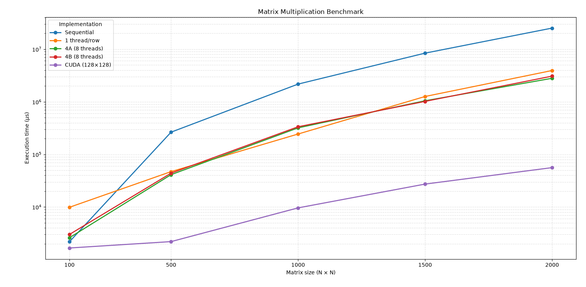

# Matrix Multiplication — Parallel Architectures (Academic Project)

A performance comparison of matrix multiplication implementations across sequential (C++), multithreaded (C++), and GPU (CUDA) approaches.

---

## Overview

This project benchmarks several implementations of NxN matrix multiplication on the same machine, from a sequential approach to a GPU-accelerated CUDA version. The goal is to measure and compare the performance gains (and pitfalls) of parallelism in a concrete, compute-heavy problem.

---

## Implementations

| Part | Description |
|------|-------------|
| Part 1 | Sequential (baseline) |
| Part 2 | One thread per cell |
| Part 3 | One thread per row |
| Part 4A | Fixed thread count — alternating distribution |
| Part 4B | Fixed thread count — contiguous distribution |
| Part 5 | CUDA (GPU) |

---

## Machine Configuration

| Component | Details |
|-----------|---------|
| OS | Windows 11 Home (Build 26200) |
| Machine | ASUS TUF Dash F15 FX517ZE |
| CPU | Intel Core i7-12650H @ 2.30 GHz (10 cores / 16 threads) |
| RAM | 16 GB DDR5-4800 |
| GPU | NVIDIA GeForce RTX 3050 Ti Laptop (4 GB GDDR6) |
| CUDA | Version 13.3 |

---

## Key Results

Execution times in microseconds for each approach:

| Matrix size | Sequential | 1 thread/row | 4A (8 threads) | 4B (8 threads) | CUDA (128×128) |
|-------------|-----------|--------------|----------------|----------------|----------------|
| 100×100 | 2 185 | 9 873 | 2 604 | 3 006 | 1 661 |
| 500×500 | 264 608 | 47 051 | 41 174 | 43 989 | 2 197 |
| 1000×1000 | 2 170 507 | 243 934 | 319 530 | 335 043 | 9 617 |
| 1500×1500 | 8 416 846 | 1 261 800 | 1 046 745 | 1 018 748 | 27 254 |
| 2000×2000 | 25 201 809 | 3 931 811 | 2 799 776 | 3 075 235 | 56 058 |

**CUDA with 128 blocks × 128 threads achieves a 450× speedup over the sequential implementation for a 2000×2000 matrix (99.78% reduction in execution time)**

---

## Main Takeaways

- Multithreading without careful design can be **worse** than sequential code (see Part 2: one thread per cell caused system freezes for N ≥ 1000).
- The optimal thread count for CPU-based approaches was **8 threads (0.5× the logical thread count)** — beyond that, scheduling overhead outweighs parallelism gains.
- The difference between alternating and contiguous thread distribution (Parts 4A vs 4B) was **not significant** in practice.
- GPU (CUDA) is dramatically faster for large matrices, but configuration matters: 128 blocks × 128 threads outperformed configurations with more blocks or threads.

---

## Report

A full written report with methodology and detailed result tables is available in [`report.pdf`](./report.pdf).

---

## Prerequisites

- C++ compiler
- NVIDIA CUDA Toolkit (tested on CUDA 13.3)
- A CUDA-compatible GPU
